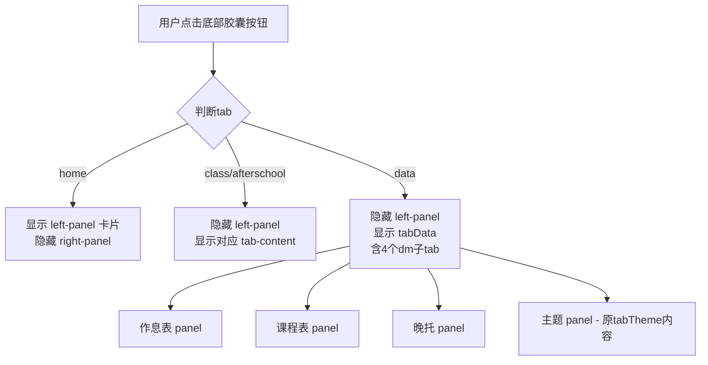

## 用户需求

### 产品概述

对现有"工作台"单页Web应用进行移动端底部导航重构，将原来4个顶部Tab按钮改造为底部浮动胶囊式导航，调整页面结构使主页显示常驻卡片，并将主题选择器并入数据管理模块。

### 核心功能

1. **底部导航重设计**：将底部导航由4个（课表/晚托/数据/主题）改为4个新项（主页/课表/晚托/数据），主题移入数据管理下作为子项
2. **浮动胶囊样式**：底部导航栏改为椭圆胶囊形状，悬浮于底边上方不贴底，选中项带彩色背景和白色图标，未选中项仅图标无背景
3. **主页卡片展示**：点击"主页"标签时，显示移动端的常驻卡片（时钟、状态、倒计时、今日作息），隐藏右侧内容区
4. **其他页面布局**：点击课表/晚托/数据标签时，隐藏常驻卡片，仅显示对应的内容面板
5. **删除顶部Tab**：移除页面上方原有的"课表/晚托/数据管理/主题"横排tab按钮栏（与底部导航功能重复）
6. **主题并入数据管理**：在数据管理面板中增加"主题"子标签页，与作息表/课程表/晚托同级

## 技术方案

### 技术栈

- 纯前端单文件 HTML/CSS/JS（与现有项目一致）
- 无框架依赖，原生 DOM 操作
- SVG 内联图标（Lucide 风格，无 CDN 依赖）

### 实现策略

#### 整体方案

基于现有 `schedule_v103.html` 文件，保持单文件架构不变。核心改动集中在三处：**底部导航样式与逻辑**（CSS + JS）、**顶部Tab移除**（HTML + CSS）、**主页逻辑与数据管理子tab扩展**（HTML + JS）。

关键设计决策：

- 桌面端保持左右分栏布局不变，仅移动端（≤600px / ≤768px）应用新UI
- 浮动胶囊导航使用 `border-radius: 28px` 创建椭圆外形，`bottom: 16px` 悬浮效果
- 选中态使用 accent 色背景 + 白色图标，通过 `.active` 类切换
- 主页逻辑通过 `switchTab('home')` 控制 `.left-panel` 和 `.right-panel` 的显示/隐藏

#### 性能考虑

- 纯CSS条件显隐，无额外渲染开销
- 图标均为内联SVG字符串，无需网络请求
- 选项卡切换通过 `display` 或 `visibility` 控制，不涉及DOM重建

#### 代码复用

- 复用现有 `switchTab()` 框架，增加 `home` 分支
- 复用现有 `switchDM()` 子tab切换逻辑，增加 `theme` 子项
- 复用现有 `createBottomBar()` / `syncBottomBar()` 底部栏工厂方法
- 复用现有 `TAB_ICONS` / `TAB_LABELS` 数据结构模式

### 实现细节

#### 执行要点

- 底部导航 `.pwa-bottom-bar` 在移动端（≤768px）显示，新增 `.pwa-bottom-capsule` 内层胶囊容器
- 胶囊容器使用 `border-radius: 28px`、`background: rgba(255,255,255,0.92)` + `backdrop-filter: blur(20px)`、`box-shadow` 提升悬浮感
- 选中按钮使用 `var(--accent)` 背景色，图标使用 `color: #fff`，并添加 `border-radius: 24px` 形成药丸高亮
- `.left-panel` 在移动端默认隐藏，仅当 `currentTab === 'home'` 时显示（通过新增CSS类 `.left-panel.mobile-visible` 控制）
- 顶部 `.tab-nav` 完全从HTML中移除，并清理相关CSS样式规则（包括移动端响应式样式）
- `#tabTheme` 的HTML内容移入 `#tabData` 作为 `dm-panel`，增加对应的 `dm-subtab` 按钮

#### 日志与兼容性

- 无需改动日志逻辑
- 保持桌面端（>768px）现有行为完全不变
- 移动端 swipe 导航同步更新 TAB_ORDER

### 架构设计



### 目录结构

```
schedule-workbench/
├── schedule_v103.html    # [MODIFY] 主应用文件，包含所有改动
│   # HTML改动:
│   #   - 删除 .tab-nav (line ~1282-1287)
│   #   - 将 #tabTheme 内容移入 #tabData 作为 dm-panel
│   #   - 在 .dm-subtabs 中添加"主题"按钮
│   # CSS改动:
│   #   - 删除 .tab-nav 及 .tab-btn 所有样式（含响应式）
│   #   - 重写 .pwa-bottom-bar 为浮动胶囊样式
│   #   - 新增 .pwa-bottom-capsule 内层容器样式
│   #   - 新增 .left-panel 移动端显隐逻辑样式
│   #   - 新增选中态胶囊按钮样式
│   # JS改动:
│   #   - TAB_ORDER 改为 ['home','class','afterschool','data']
│   #   - TAB_ICONS 添加 'home' 图标，移除 'theme'
│   #   - TAB_LABELS 更新对应文案
│   #   - createBottomBar() 适配胶囊结构
│   #   - switchTab() 新增 'home' 分支，移除 'theme' 分支
│   #   - switchDM() 扩展支持 'theme' 子项
│   #   - syncBottomBar() 适配新tab名
│   #   - swipe/pull-to-refresh 更新tab引用
```

### 关键代码结构

底部胶囊HTML结构（由JS动态生成）：

```
nav.pwa-bottom-bar
  └── div.pwa-bottom-capsule
        ├── button.pwa-bottom-btn[data-pwa-tab="home"]
        ├── button.pwa-bottom-btn[data-pwa-tab="class"]
        ├── button.pwa-bottom-btn[data-pwa-tab="afterschool"]
        └── button.pwa-bottom-btn[data-pwa-tab="data"]
```

`switchTab()` 新增 home 分支逻辑：

```javascript
if(tab==="home"){
  // 移动端：显示 left-panel，隐藏 right-panel 所有 tab-content
  // 桌面端：保持原有左右布局不变
}
```

## 使用的 Agent 扩展

### Skill

- **frontend-design**
- 目的：为底部浮动胶囊导航提供视觉设计指导，确保胶囊样式、选中态配色、图标与背景对比度符合现代移动端设计规范
- 预期成果：产出包括圆角参数、阴影层级、选中态渐变色方案、图标尺寸比例的设计建议

- **ui-styling**
- 目的：实施浮动胶囊式底部导航栏的 CSS 样式，包括椭圆外形、悬浮阴影、选中态彩色背景、白色图标切换、过渡动画
- 预期成果：完成胶囊导航的完整 CSS 样式代码，含移动端响应式断点和 safe-area 适配