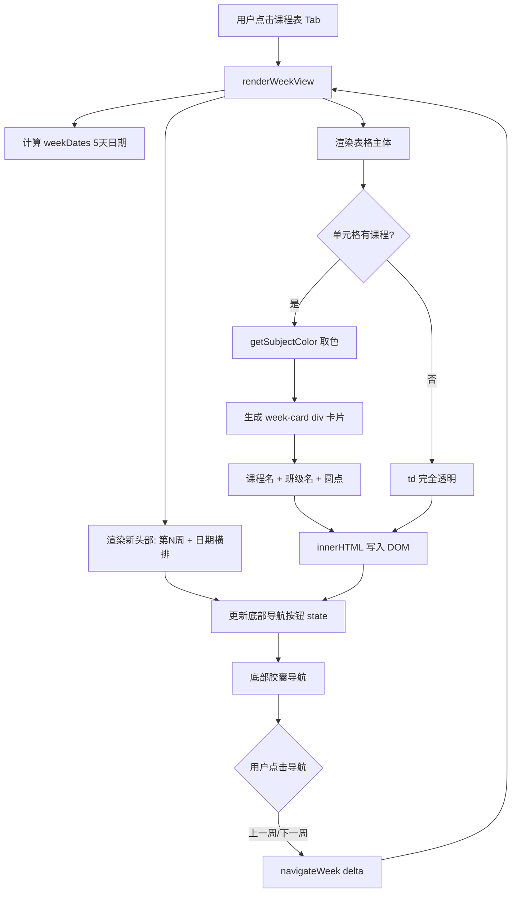

## 产品概述

对现有教师作息工作台的「周视图」（课程表 Tab）进行卡片化视觉升级。将当前传统表格风格改造为圆角粉彩卡片布局，参考 shadcn/ui Card 组件的轻量卡片语义和 Apple Calendar 的周视图信息层级。晚托区域不做任何改动。

## 核心功能

### 1. 新头部布局

- 左侧：大号"第N周"标题（`font-size:24px; font-weight:700`）+ 小字"周"
- 右侧：周一至周五横排日期行，每列上方星期名（周一~周五），下方日期数字
- 今天的日期列绿色高亮（文字 `#16A34A` + 底部圆点标记）
- 移除原有的左右箭头导航和 date input

### 2. 卡片化课程单元格

- 有课单元格：`<td>` 内嵌 `<div class="week-card">` 圆角卡片（`border-radius:12px`），粉彩学科色背景（`hsl(h, 22%, 87%)`），极细阴影（`box-shadow:0 1px 3px rgba(0,0,0,0.05)`），内显课程名（bold）+ 班级名（小字 muted）
- 空单元格：`<td>` 完全透明，无边框无背景无内容
- 保持代课/换课圆点标记（右上角小圆点）
- 保持当前节次 pulse 动画和 today 高亮

### 3. 学科粉彩配色体系

- 基于课程名字符串哈希自动生成一致性柔和色（HSL 模型：饱和度 18-30%，明度 82-92%）
- 同一课程名始终返回同一颜色（确定性哈希）
- 色相均匀分布，相邻课程视觉区分

### 4. 节次标签圆角化

- 从透明背景改为浅灰圆角容器：`background:#F1F5F9; border-radius:8px; padding:4px 6px`

### 5. 区域分隔呼吸感

- `section-divider` 上下 padding 从 8px 增大到 16px（上午/下午/晚上间隔更明显）
- 字体加大 1px，颜色稍浅

### 6. 底部胶囊导航

- 三等分按钮「上一周 | 本周 | 下一周」
- 圆角胶囊形（`border-radius:99px`），柔和描边
- 当前周按钮填充 accent 色高亮
- 点击调用 `navigateWeek(delta)`

### 7. 表头轻量化

- 从 `#597AB5` 纯色大色块改为：浅灰底（`#F8FAFC`）+ 深色文字（`#475569`）
- 底部细线分隔（`border-bottom:2px solid #E2E8F0`）
- 今天列保留绿色高亮文字

### 8. 响应式适配

- 移动端（≤600px）：卡片字号 12px，padding 缩减，底部导航高度 38px
- 平板端（≥601px）：卡片字号 14px，padding 增大，底部导航高度 44px

## 技术方案

### 实现策略

纯 CSS + JS 内联样式字符串替换。不引入任何外部库或组件。所有修改集中在 `schedule_v103.html` 内，涉及 CSS 样式重写、HTML 结构调整、JS 渲染逻辑改造三个层面。

### 关键设计决策

1. **学科色生成算法**：`getSubjectColor(courseName)` 基于字符串累加哈希映射到 HSL(h, 22%, 87%)，其中色相 = `hash % 360`，保证相同课程名返回相同颜色，色相分布均匀

2. **卡片嵌入 `<td>` 内而非替代 td**：保持表格布局语义，`<td>` 透明化，`<div class="week-card">` 作为卡片容器。这样表格的结构性（等宽列对齐、行高一致）不受影响，同时空 td 可以完全透明

3. **头部日期行独立于表格**：新头部（"第N周" + 日期横排）作为独立 div 放在表格上方，不修改 thead 结构，保持 thead 用于列标识

4. **底部导航替换而非叠加**：移除顶部 `.weekly-week-nav` 箭头导航和 date input，底部新增胶囊导航，`navigateWeek()` 函数逻辑保持不变

5. **粉彩饱和度上限控制**：通过 HSL 模型精确控制饱和度 22% ± 4%（范围 18-30%），明度 87% ± 5%（范围 82-92%），确保所有卡片柔和统一

### 性能考虑

- `getSubjectColor()` 每次渲染调用 O(1) 时间复杂度（简单哈希），不缓存（课程数 ≤ 20，无性能压力）
- 卡片渲染为纯字符串拼接，无 DOM 操作开销
- 移动端卡片高度自适应 `min-height`，无额外重排

### 兼容性

- `openWeekCellPopup` 点击弹窗逻辑不变（td onclick 保持不变）
- 代课/换课圆点标记不变（`.wcell-dot` 样式保持不变）
- `navigateWeek(delta)` / `goToWeekDate()` 函数不变
- 个人课表/班级课表导出函数不受影响
- 晚托区域全部 CSS/JS 不做任何修改

## 架构设计



## 目录结构

```
schedule-workbench/
└── schedule_v103.html          # [MODIFY] 唯一修改文件
    ├── CSS 行 1069-1220        # [MODIFY] 周视图样式全面重写
    │   ├── 行 1072-1087        # [REPLACE] .weekly-header → 新头部布局
    │   ├── 行 1088-1103        # [DELETE] .weekly-week-nav 旧导航
    │   ├── 行 1104-1113        # [DELETE] .weekly-date-input 旧日期选择器
    │   ├── 行 1114-1119        # [KEEP] .weekly-grid-wrap / .weekly-grid
    │   ├── 行 1120-1126        # [MODIFY] .weekly-grid th 表头轻量化
    │   ├── 行 1127-1141        # [MODIFY] .weekly-grid td 去边框透明化
    │   ├── 行 1143-1146        # [MODIFY] .period-label 圆角容器
    │   ├── 行 1147-1152        # [MODIFY] .section-divider 增大间距
    │   ├── 行 1153-1167        # [MODIFY] .wcourse-* 适配卡片内容
    │   ├── 行 1167-1167        # [ADD] .week-card 卡片核心样式
    │   ├── 行 1167-1167        # [ADD] .week-header-new 新头部
    │   ├── 行 1167-1167        # [ADD] .week-nav-bottom 底部导航
    │   ├── 行 1176-1183        # [MODIFY] 移动端响应式适配
    │   └── 行 1184-1191        # [MODIFY] 平板端响应式适配
    ├── HTML 行 1410-1426       # [MODIFY] 周视图容器结构
    │   ├── 行 1411-1418        # [REPLACE] .weekly-header 新头部
    │   └── 行 1425-1426        # [ADD] 底部胶囊导航 + 保持 .weekly-stats
    └── JS 行 2310-2407         # [MODIFY] renderWeekView 卡片渲染
        ├── 行 2310-2340        # [MODIFY] 新增头部渲染 + 日期行
        ├── 行 2384-2393        # [REPLACE] 单元格卡片化 + getSubjectColor
        └── 行 2400-2406        # [ADD] 底部导航按钮状态更新
```

## 关键代码结构

### getSubjectColor 函数签名

```js
// 基于课程名字符串生成一致性柔和粉彩色
// 输入: "语文" → 输出: "hsl(42,22%,87%)"
// 饱和度范围: 18-30%, 明度范围: 82-92%
function getSubjectColor(courseName) { ... }
```

### 新头部 HTML 结构

```html
<div class="weekly-header">
  <div class="week-title-area">
    <span class="week-title-num" id="weekTitleNum">第1</span>
    <span class="week-title-suffix">周</span>
  </div>
  <div class="week-date-row" id="weekDateRow">
    <!-- JS动态生成5列: 星期名+日期, 今天绿色高亮 -->
  </div>
</div>
```

### 底部导航 HTML 结构

```html
<div class="week-bottom-nav" id="weekBottomNav">
  <button onclick="navigateWeek(-1)">上一周</button>
  <button class="active" id="weekNavCurrent">本周</button>
  <button onclick="navigateWeek(1)">下一周</button>
</div>
```

## 设计风格

采用「柔和粉彩卡片」风格，灵感来自 shadcn/ui Card 组件的轻量容器语义和 Apple Calendar 的周视图布局。核心视觉语言：圆角 12px 卡片 + 粉彩底色 + 极细阴影 + 大量留白。

### 顶部头部（新设计）

- 左侧「第N周」大号深蓝数字（24px / 700 weight），旁附小号「周」字
- 右侧 5 列日期横排，每列上方灰色星期名（周一~周五，12px），下方日期数字（14px / 600 weight）
- 今天的列：日期数字绿色 `#16A34A`，星期名绿色，底附 4px 绿色圆点标记

### 课程卡片网格

- 表头：浅灰底色 `#F8FAFC`，底部 `2px solid #E2E8F0` 分隔线，深灰文字 `#475569`
- 左侧节次列：浅灰圆角容器 `background:#F1F5F9; border-radius:8px` 包裹数字
- 有课卡片：圆角 `12px`，粉彩学科色底，`box-shadow:0 1px 3px rgba(0,0,0,0.05)`，课程名 bold（14px）+ 班级名 secondary（12px / opacity 0.65），右上角保留代课/换课圆点
- 空单元格：完全透明（无背景、无边框、无内容）
- 区域分隔行：灰色文字"上午/下午/晚上"，上下 14-16px 留白

### 底部导航

- 三等分圆角胶囊按钮，`border-radius:99px`，高 42-44px
- 非激活态：白色背景 + 灰色描边 + 灰色文字
- 激活态（本周）：`var(--accent)` 填充背景 + 白色文字
- hover：轻微背景色变化 + translateY(-1px)

## Agent Extensions

### Skill: frontend-design

- **目的**：指导卡片式周视图的整体视觉方向——从"表格"到"卡片网格"的认知转变，确保卡片悬浮感（极细阴影）、粉彩配色饱和度控制、空单元格透明度等决策有明确的美学依据
- **预期成果**：产出卡片 `box-shadow` 精确数值（`0 1px 3px rgba(0,0,0,0.05)`）、圆角半径 12px 的理由、以及"less is more"的留白策略

### Skill: ui-ux-pro-max

- **目的**：验证改造后的触摸目标尺寸（卡片单元格 ≥ 44px）、对比度（粉彩底 + 深色文字 ≥ 4.5:1）、动画性能（transform 代替 width/height 变更）、响应式断点合理性
- **预期成果**：确认移动端卡片可点击区域达标、色彩对比度通过 AA 标准、底部导航按钮符合 48px 触控规范

### Skill: using-superpowers

- **目的**：确保技能加载顺序和纪律——先 frontend-design 定视觉方向，再 ui-ux-pro-max 做 UX 验证
- **预期成果**：按正确流程执行，避免跳过关键设计审查步骤